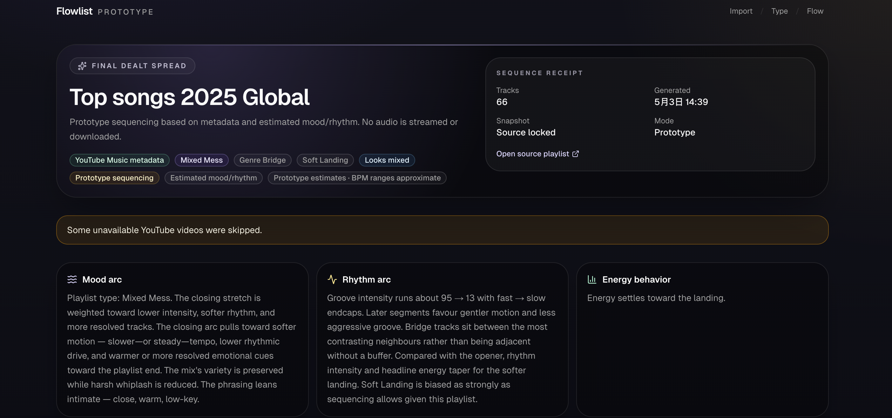

# Flowlist

Turn a scattered playlist into a listening journey. Import tracks, choose a flow card, then copy the new order to use or share. Flowlist sequences by estimated mood, rhythm, and energy; it does not analyze audio or lyrics.

[Try the demo playlist — no account or API key needed](https://flow-list-kappa.vercel.app/import?demo=1) · [Live app](https://flow-list-kappa.vercel.app/)



The demo loads sample tracks entirely in the browser. Visitors can finish the flow and copy a numbered track list without configuring a key. Importing a public YouTube playlist uses the server's YouTube API key.

## What it does

- Import public YouTube Music / YouTube playlists
- Choose playlist type
- Choose up to 2 flow keywords
- Generate prototype listening order
- Copy a clean numbered order; YouTube imports include direct video links
- Download a detailed text report with placement and transition notes
- View mood chapters, energy/rhythm arcs, and transition explanations

## Best for

- Mixed artists
- Mood swings
- Weird transitions
- Long saved playlists

## Tech Stack

- Next.js
- TypeScript
- Tailwind CSS
- YouTube Data API
- Vercel

## Limitations

Flowlist currently uses metadata and prototype mood/rhythm estimates. It does not stream, download, or analyze audio. BPM values are approximate ranges. No real AI model or third-party BPM provider is connected yet.

## Future Work

- AI feature estimation
- Third-party BPM provider
- Better artist/title matching
- Virtualized results for very large playlists
- Authenticated YouTube playlist creation (requires user OAuth and write permission)

## YouTube Music first

The **primary import path** is a public **YouTube Music** or **YouTube** playlist URL. The app uses the **YouTube Data API v3** (server-side only) to read **playlist and video metadata** — titles, channels, thumbnails, links — then applies **mock sequencing** (not real AI yet).

YouTube playlist imports are intentionally bounded. Choose an import depth in the UI:

- **Quick scan** — first 100 tracks
- **Standard** — first 200 tracks (default)
- **Deep sequence** — first 300 tracks

Large imports may take longer to analyze and use more YouTube API quota.

## Other ways to load tracks

- **Manual paste** — one track per line (`Artist - Song`, `Song - Artist`, `Artist, Song`, etc.). Only your pasted text is used.
- **Demo playlist** — clearly labeled **mock data** for testing the UI and sequencer.
- **Experimental Spotify import** — optional **legacy** path using Spotify client credentials. Public playlist access can be **limited by Spotify**; if it fails, use YouTube Music or manual paste. No Spotify OAuth, Audio Features, Audio Analysis, recommendations, or playlist writes.

## Environment variables

Create `.env.local` (never commit real keys):

| Variable | Required | Purpose |
|----------|----------|---------|
| `YOUTUBE_API_KEY` | **Yes** for YouTube import; **no** for demo or manual paste | YouTube Data API v3 key (server only; not exposed to the browser). |
| `SPOTIFY_CLIENT_ID` | No | Experimental Spotify import only. |
| `SPOTIFY_CLIENT_SECRET` | No | Experimental Spotify import only. |

See `.env.example` for a template.

## Development

```bash
npm install
npm run dev
```

Open [http://localhost:3000](http://localhost:3000).

```bash
npm test
npm run lint
npm run build
```

### Verify the import origin guard

Next.js 16 uses `src/proxy.ts` to reject cross-origin browser POSTs to the
YouTube playlist import route before any provider request is made. With the dev
server running, this manual check should return `HTTP/1.1 403`:

```bash
curl -i -X POST http://localhost:3000/api/youtube/playlist \
  -H 'Origin: https://cross-origin.example' \
  -H 'Content-Type: application/json' \
  --data '{"url":"https://www.youtube.com/playlist?list=test"}'
```

## Safety / scope

- No **authentication**, **database**, **payment**, or **real AI API** calls in this prototype.
- **No** Amazon Music integration.
- Metadata and user text only — **no** storage of audio/video files.
- Copying an order does not create a playlist in the user's YouTube account.

## License

[MIT](./LICENSE)

## Tech stack

Next.js (App Router), TypeScript, Tailwind CSS, shadcn/ui.
